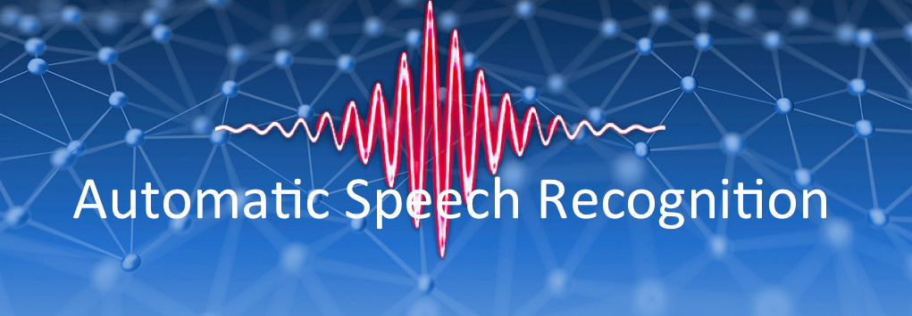
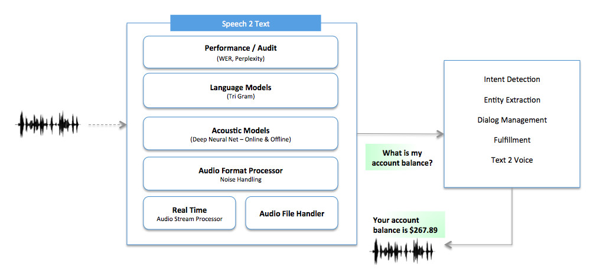
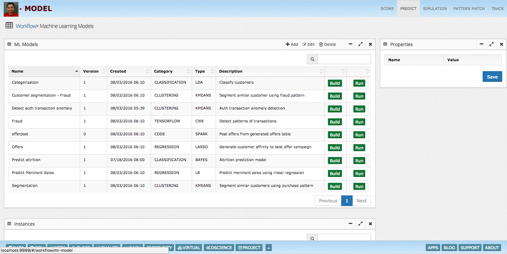
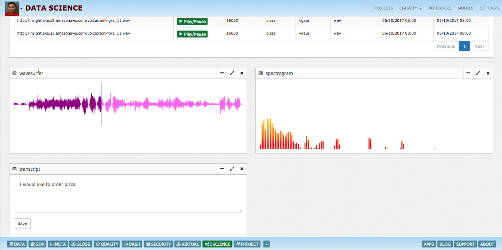
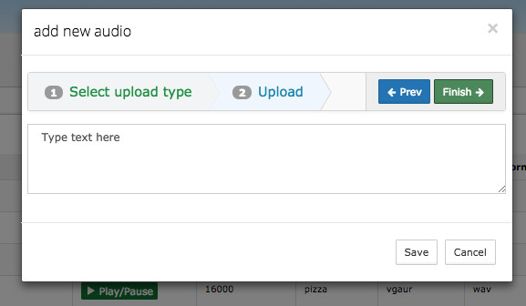
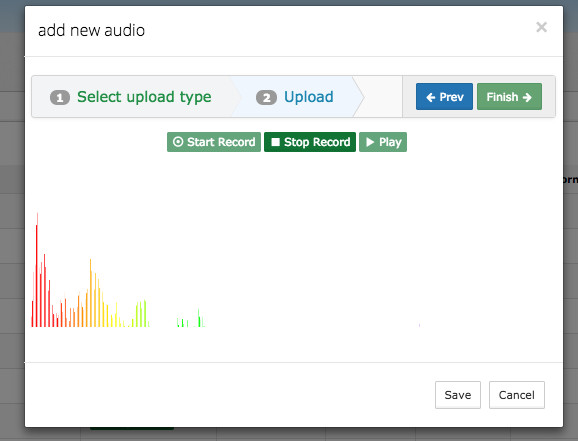

# ASR (Automatic Speech Recognition)

This is the part of learning series where we are going to share our Virtual Agent framework architecture and its component. Virtual Agent framework is built on top of AI & Data platform, which provides foundational capabilities like data science models, data workflows, governance and security.

## Speech 2 Text / Automatic Speech Recognition (ASR)
First part of InsightLake Virtual Agent framework is speech 2 text conversion. Users will speak on phone or computer and audio will be streamed to Virtual Agent. Virtual Agent framework uses InsightLake's Speech 2 Text solution, which uses deep learning and machine learning models to perform acoustic and language modeling.

As shown in the diagram above Speech2Text solution takes audio input as stream or file and it outputs text.

## Interface
Speech2Text solution exposes REST and function interfaces to perform conversion. It expects users to provide following parameters as input:

In case of stream - user should connect using WebSocket and audio must be streamed in PCM, mono and 16KZ rate
In case of REST, audio path or base64 encoded audio must be provided.
Output provides text along with accuracy score. In case of stream multiple json responses are sent to the caller.
Performance Monitoring
Like other InsightLake machine learning models Speech 2 Text solution collects run time audit events and captures model performance. Following parameters are captured:

Input data & connection parameters
Output transcript
WER (Word error rate) & Perplexity
Conversion times
These runtime events by default streamed to Kafka & stored in search database but could be customized easily.

## Speech 2 Text Architecture

In this section we will talk about framework's internals, acoustic and language modeling. Before we start with models lets talk about Speech basics.

## Acoustic Modeling
In this section we will talk about how we take sound frame and generate phoneme.

Phoneme is one of the units of sound that distinguish one word from another in a particular language.

## Sound Basics
When we speak the sound is generated and filtered by the shape of the vocal tract including tongue, teeth etc. This shape determines what sound comes out. If we can determine the shape accurately, this should give us an accurate representation of the phoneme being produced.

Sound has two components Frequency and Amplitude.

When we digitize the sound by taking samples we keep the rate, take amplitude and collect the data. Then we perform encoding in mp3, ogg.. etc..to compress the data.

Generation of Phoneme from time samples is hard
Human ear recognizes sound using frequency in logarithmic way (We can distinguish sound in lower frequency spectrum well and as frequency increases recognition follows log pattern). To mimic human ear behavior we convert sound from time domain to frequency domain. This conversion is done by taking Fourier Transform.

## Fourier Transform
Fourier transform produces frequency spectrum which varies with time. It is called Spectrogram.

## Spectrogram
A spectrogram is a visual representation of the spectrum of frequencies of sound or other signal as they vary with time or some other variable. Spectrograms are sometimes called voiceprints, 

or voicegrams.

Sampling voice spectrum helps us in decoding phoneme associated with the frequency variation.

## Cepstral Analysis
The shape of the vocal tract manifests itself in the envelope of the short time power spectrum, and the job of MFCCs is to accurately represent this envelope.

## Mel Frequency Cepstral Coefficient (MFCC)
The first step in any automatic speech recognition system is to extract features i.e. identify the components of the audio signal that are good for identifying the linguistic content and discarding all the other stuff which carries information like background noise, emotion etc.

Mel Frequency Cepstral Coefficents (MFCCs) are a feature widely used in automatic speech and speaker recognition. 

## Acoustic Models
MFCC features are fed to DNN (Deep neural network models) to classify frames to phoneme. Currently we are using DNN models and experimenting with Seq2Seq models (Sequence to sequence modeling) and CTC (Connectionist temporal classification) with RNNs (Recurrent Neural Network).

## Language Modeling
Before we do acoustic modeling, we need to prepare our language models. Language model takes the transcripts corpus during training and creates vocabulary, lexicons and language model (based on n-gram). InsightLake ASR solution uses tri-gram models which have reasonable perplexity.

## Voice Training
Users can use InsightLake's UI to train voice models using their audio files. To build/adapt a voice model they need to load audio data to distributed file systems like HDFS or S3.

Users can create a new data science project and voice model using data science workbench.

They can create voice profile where they can select the distributed audio location, setup transcripts etc. Users can then perform adaptive training.

Users can add audios to existing audio collection for training.

Users can also add new audio by uploading it and they can add transcript.

User can record audio & provide transcripts.

Users can also generate audio. Audio is generated by the backend text to speech system.

Users can perform training on multi-GPU/CPU cluster.

Users can save the generated model and deploy them. They can see the stats and performance.

Custom words, acronyms are automatically handled when they are part of transcripts.

## Testing
Voice model can be tested by uploading audio file and getting text back or using live recording and seeing live transcription.

To learn more, check out [http://insightlake.com/dataexplorer.html](http://insightlake.com/dataexplorer.html)

Installation
------
* Download or clone the repository. 
* Run bin/insightlake command.
* Open browser with URL as http://localhost:8080/
* Change configuration in /conf folder to set different ports
* By default H2 database is used, you can change the database details in jdbc.properties file

License
------
InsightLake Data Explorer is a commercial product but distributed to be used freely. Please contact contact@insightlake.com for details.

Getting Help
----------

You can get help easily :
Community - Google Groups
Slack Channel
Twitter
Facebook
Email: contact@insightlake.com
